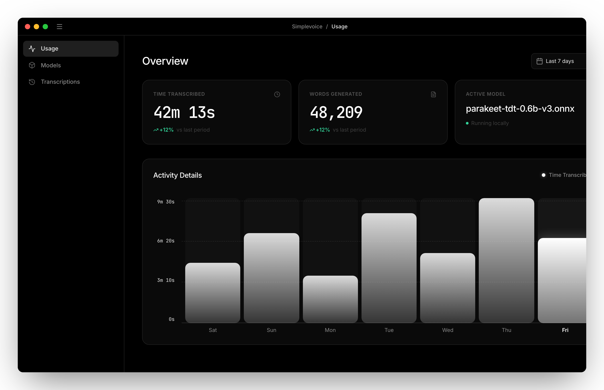
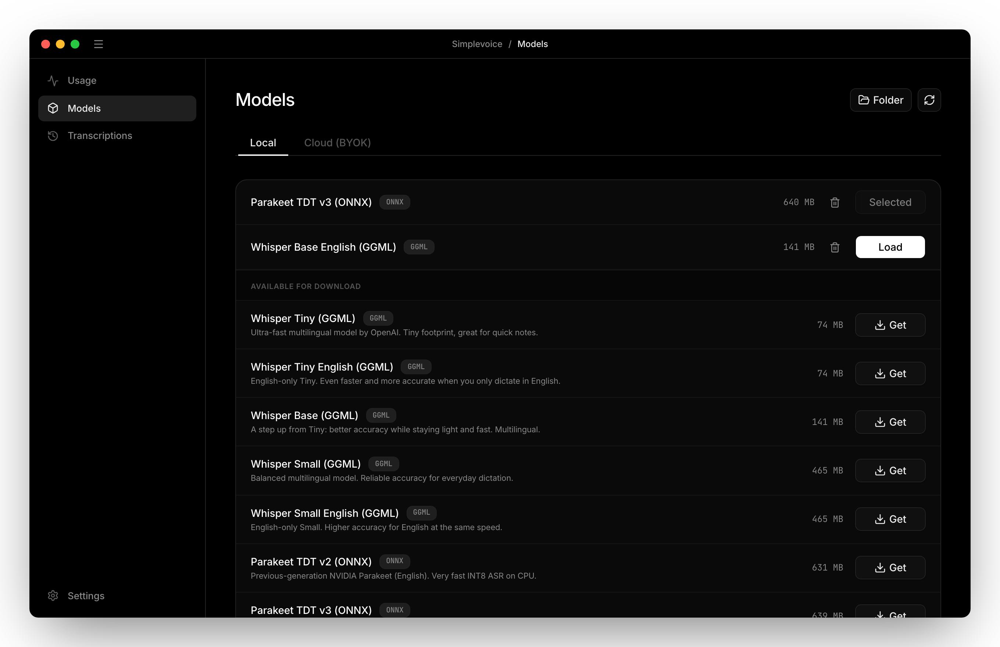
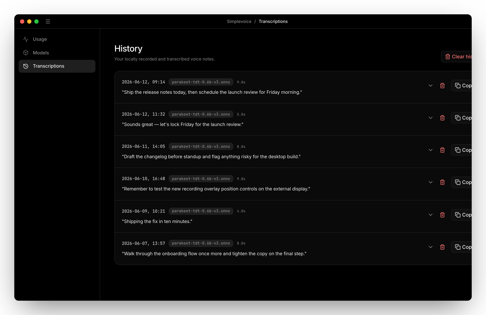
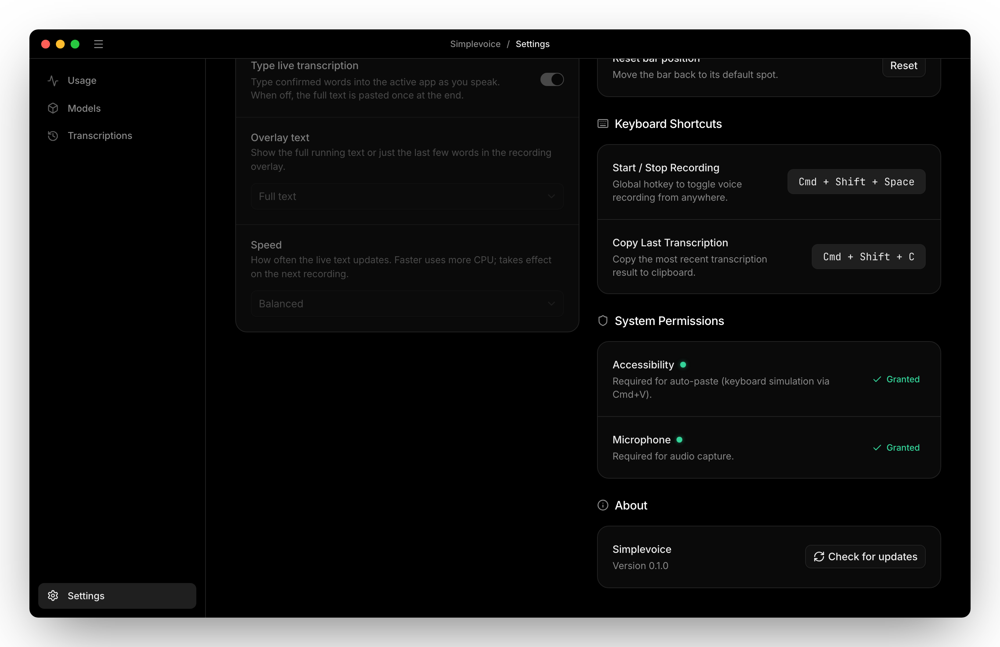

<div align="center">


# Simplevoice

**Privacy-first, local & offline Speech-to-Text and voice typing for the desktop.**

<p>
  
  
  
  
  
</p>

<p>
  <a href="#features">Features</a> ·
  <a href="#screenshots">Screenshots</a> ·
  <a href="#speech-to-text-engines">Engines</a> ·
  <a href="#platform-support">Platforms</a> ·
  <a href="#install">Install</a> ·
  <a href="#configuration">Configuration</a> ·
  <a href="#build-from-source">Build</a>
</p>

</div>

---

Simplevoice turns what you say into finished text — fast, accurate, and with nothing in the way. It records system audio, runs speech models **completely offline on your device**, and types the result straight into the active app or copies it to your clipboard. Prefer the cloud? Bring your own key. Either way: no accounts, no telemetry, fully open-source.

---

## Screenshots

<table>
  <tr>
    <td align="center"><br/><sub>Usage dashboard — time transcribed, words generated, active model and 7-day activity</sub></td>
    <td align="center"><br/><sub>Built-in model manager — download, import and switch local models</sub></td>
  </tr>
  <tr>
    <td align="center"><br/><sub>Full local history — every transcription stored on-device in SQLite</sub></td>
    <td align="center"><br/><sub>Preferences — interface, audio input, live transcription and recording feedback</sub></td>
  </tr>
  <tr>
    <td colspan="2" align="center"><br/><sub>The floating recording overlay with a live waveform — speak anywhere, text lands in the active app</sub></td>
  </tr>
</table>

---

## Features

### Native audio recording & VAD
- High-fidelity capture via the Rust-native **CPAL** library.
- A sleek floating overlay window with a real-time audio waveform.
- **Voice Activity Detection** — recording stops and transcription begins automatically when you stop speaking.

### Local & offline speech recognition
- Multiple ASR backends, all running on your machine (see [engines](#speech-to-text-engines) below).
- Hardware acceleration: **Metal** on macOS, **Vulkan** on Linux/Windows, with a safe CPU fallback.

### Cloud, on your terms (BYOK)
- Optional bring-your-own-key transcription via OpenAI, OpenRouter, Google Gemini, or any OpenAI-compatible endpoint.
- API keys are stored **only in the OS keyring** (`keyring` crate) — never on disk or in `localStorage`.

### Global shortcuts & auto-paste
- A customizable global hotkey toggles recording from anywhere in the OS (default `Ctrl/Cmd + Shift + Space`).
- **Auto-paste** types your dictation directly into the active text field:
  - **macOS** — native accessibility API simulation.
  - **Linux (Wayland)** — in-process injection via `zwp_virtual_keyboard_v1`, no external tools (no `wtype`).
  - **Linux (X11) / Windows** — robust keyboard simulators.
- Copy your last dictation instantly with a second hotkey (default `Ctrl/Cmd + Shift + C`).

### History & usage analytics
- Full local history of transcriptions, durations, word counts, and WAV paths in **SQLite** (`tauri-plugin-sql` + `sqlx`).
- A statistics dashboard with totals and 7-day / 30-day / all-time charts.

### Built-in model manager
- Browse and download recommended local models (Whisper GGML, Parakeet ONNX) in-app, with live progress.
- Import your own models or drop them into the models directory.

---

## Speech-to-text engines

### Local (offline)

| Engine | Models | Acceleration |
| --- | --- | --- |
| **Whisper.cpp** (`whisper-rs`) | Whisper GGML / GGUF (tiny → large) | Metal (macOS), Vulkan (Linux/Windows) |
| **Candle** | Whisper, Wav2Vec2 / CTC (Hubert, WavLM, …) | CPU, Metal on macOS |
| **sherpa-ONNX** | Parakeet TDT v3 (INT8), Moonshine | CPU |
| **NeMo** *(experimental)* | FastConformer-CTC, Conformer-RNN-T | Python sidecar |

### Cloud (bring your own key)

| Provider | Default model | Endpoint |
| --- | --- | --- |
| **OpenAI** | `whisper-1` | `api.openai.com` |
| **OpenRouter** | `openai/whisper-large-v3` | `openrouter.ai` |
| **Google Gemini** | `gemini-1.5-flash` | `generativelanguage.googleapis.com` |
| **Custom** | your choice | any OpenAI-compatible URL |

> Anthropic Claude is intentionally not offered for transcription — Claude does not support audio input.

---

## Platform support

| Platform | GPU | Auto-paste | Notes |
| --- | --- | --- | --- |
| **macOS** (10.15+) | Metal | Accessibility API | `NSPanel` floating overlay, native media control |
| **Windows** | Vulkan | `enigo` simulator | WinRT media control |
| **Linux (X11)** | Vulkan | keyboard simulator | `evdev` shortcuts, MPRIS2 media |
| **Linux (Wayland)** | Vulkan | `zwp_virtual_keyboard` | pure-Rust, no external tools |

---

## Install

Download the latest installer for your platform from the [Releases](https://github.com/MaciejKolerski/simplevoice/releases) page, or [build from source](#build-from-source).

After first launch:

1. Open **Models**, then download a local model (e.g. Parakeet TDT v3) or add your cloud API key.
2. On macOS, grant **Microphone** and **Accessibility** permissions when prompted (Accessibility is required for auto-paste).
3. Press `Ctrl/Cmd + Shift + Space` anywhere and start talking.

---

## Configuration

### Keyboard shortcuts

Configure global hotkeys under **Settings → Keyboard Shortcuts**:

| Action | Default |
| --- | --- |
| Toggle recording | `Ctrl/Cmd + Shift + Space` |
| Copy last transcription | `Ctrl/Cmd + Shift + C` |

The floating recording bar can be repositioned by dragging; its position controls live under **Settings → Recording & Feedback**.

---

## Build from source

### Prerequisites
- **Rust** (stable) — [rustup.rs](https://rustup.rs)
- **Node.js** 20+ and **pnpm** — [pnpm.io](https://pnpm.io)
- **System dependencies** — see the [Tauri 2 prerequisites](https://tauri.app/start/prerequisites/) for your platform (build tools, WebKit2GTK on Linux, etc.)

### Develop
```bash
pnpm install
pnpm tauri dev
```

### Build a production bundle
```bash
pnpm build        # type-check + build the frontend
pnpm tauri build  # compile the Rust backend and package an installer
```

### Lint
```bash
pnpm lint         # TypeScript type checks (tsc --noEmit --strict)
```

> Always use `pnpm tauri …` — the wrapper in `scripts/tauri.js` applies the Windows Cargo path and CRT fixes.

---

## Tech stack

- **Frontend** — React 19, TypeScript, Vite, Tailwind v4, Lucide icons.
- **Backend** — Tauri 2, Rust, SQLite (`tauri-plugin-sql` + `sqlx`).
- **Audio** — CPAL (capture), Hound (WAV), Rodio (sound effects).
- **Inference** — `whisper-rs`, `candle`, `sherpa-onnx` / `ort`, with OS keyring for secrets.

---

## Contributing

Issues and pull requests are welcome — bug reports, feature ideas, and patches all help. Please run `pnpm lint` before opening a PR, and verify core changes (audio, STT, shortcuts, recording window) with `pnpm tauri dev`.

## License

Simplevoice is open-source software licensed under the **Apache-2.0** License. See [LICENSE](LICENSE).
