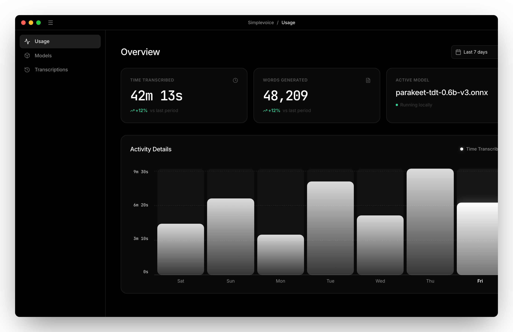
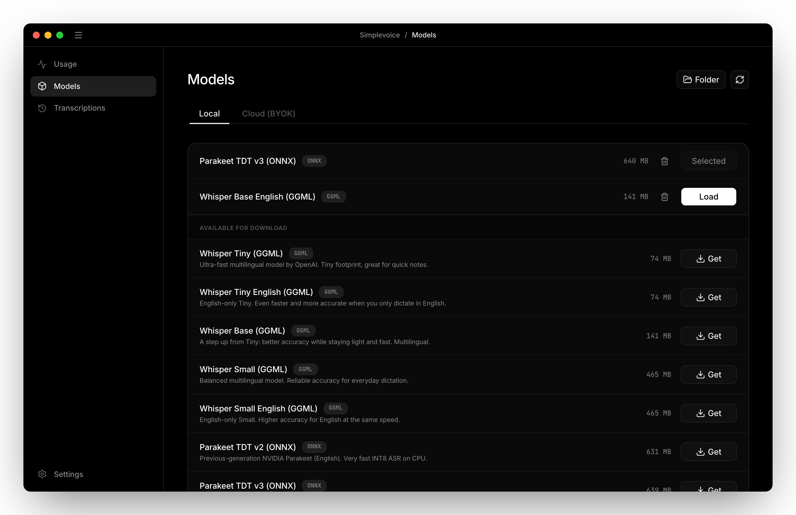

<div align="center">


# Simplevoice

**Local speech-to-text and voice typing for macOS, Linux, and Windows.**

[Download](https://github.com/MaciejKolerski/simplevoice/releases) |
[Build from source](#build-from-source) |
[License](#license)

</div>

Simplevoice records microphone input, transcribes speech, and sends the result to the active application. You can use a local model without an account or connect your own cloud provider.

<p align="center">
  
</p>

<details>
<summary>More screenshots</summary>

<table>
  <tr>
    <td></td>
    <td></td>
  </tr>
</table>

</details>

## Features

- Local transcription with downloadable Whisper, Parakeet, and Zipformer models.
- Optional cloud transcription with secrets stored in the operating system keyring.
- Global shortcuts for recording and copying the latest transcription.
- Toggle recording, push-to-talk, optional Voice Activity Detection, and a 90 minute recording safety limit.
- A movable recording overlay with a live waveform and optional live transcription for local models.
- Paste, direct typing, or clipboard-only output, with an option to restore the previous clipboard text.
- Local transcription history with saved WAV recordings, playback, deletion, and usage statistics.
- Microphone selection, language hints, text cleanup, sound feedback, media pause and resume, autostart, and update checks.

## Transcription backends

### Local

| Backend | Supported models |
| --- | --- |
| whisper.cpp via `whisper-rs` | Whisper GGML model files |
| Candle | Compatible Hugging Face Whisper directories with safetensors weights |
| sherpa-onnx | ONNX transducer and Moonshine directories, including Parakeet and Zipformer |

The in-app catalog provides several Whisper GGML models, Parakeet TDT v2 and v3, and Zipformer GigaSpeech. The whisper.cpp backend can use Metal on macOS and Vulkan on Linux, with CPU fallback.

### Cloud

Bring-your-own-key providers include OpenAI, Groq, Deepgram, AssemblyAI, Speechmatics, Gladia, Rev AI, ElevenLabs, Together AI, Fireworks AI, DeepInfra, Lemonfox.ai, Cloudflare Workers AI, Replicate, Hugging Face, Microsoft Azure AI Speech, Google Cloud Speech-to-Text, Google AI Studio, and Amazon Transcribe.

The model selector is populated after the required provider credentials and settings are supplied.

## Privacy and data

- Local transcription works without an internet connection after a model is downloaded.
- Recordings, transcription history, settings, and usage totals are stored on the device.
- Cloud secrets are stored in the operating system keyring, not in app files or browser storage.
- Cloud mode sends audio chunks to the provider you select. Its terms and data policy apply.
- Simplevoice does not include analytics or telemetry.

## Install

Download the latest package for your platform from [GitHub Releases](https://github.com/MaciejKolerski/simplevoice/releases).

After the first launch:

1. Open **Models** and download a local model, or configure a provider under **Cloud (BYOK)**.
2. On macOS, allow microphone access. Accessibility permission is also required for automatic paste or typing.
3. Press `Ctrl+Shift+Space` on Linux or Windows, or `Cmd+Shift+Space` on macOS, and start speaking.

The default shortcut for copying the latest transcription is `Ctrl+Shift+C` on Linux and Windows or `Cmd+Shift+C` on macOS. Shortcuts can be changed in **Settings > Shortcuts**.

### Linux notes

- GNOME, KDE Plasma, XFCE, Cinnamon, and MATE use their desktop shortcut configuration.
- niri, Hyprland, Sway, and i3 use direct evdev capture when `/dev/input` is readable. Otherwise Simplevoice adds a marked shortcut section to the compositor configuration. The active method is shown in Settings.
- Automatic paste and direct typing on Wayland require the `zwp_virtual_keyboard_v1` protocol. GNOME and Mutter do not expose it. Use standard non-live transcription and paste from the clipboard manually on those compositors.

## Build from source

Requirements:

- Rust stable
- Node.js 20 or newer
- pnpm
- The [Tauri 2 system prerequisites](https://tauri.app/start/prerequisites/) for your platform

```bash
pnpm install
pnpm tauri dev
```

Useful checks and production build:

```bash
pnpm lint
pnpm check:i18n
pnpm test:history-audio
pnpm tauri build
```

Use `pnpm tauri` instead of calling the Tauri CLI directly. The project wrapper applies required Windows build settings.

The application uses Tauri 2 and Rust for the desktop backend, React 19 and TypeScript for the interface, CPAL for audio capture, and SQLite for local history.

## Contributing

Issues and pull requests are welcome. Run `pnpm lint` before submitting a change and test audio, model, shortcut, or overlay changes with `pnpm tauri dev`.

## License

Licensed under Apache-2.0. See [LICENSE](LICENSE).
